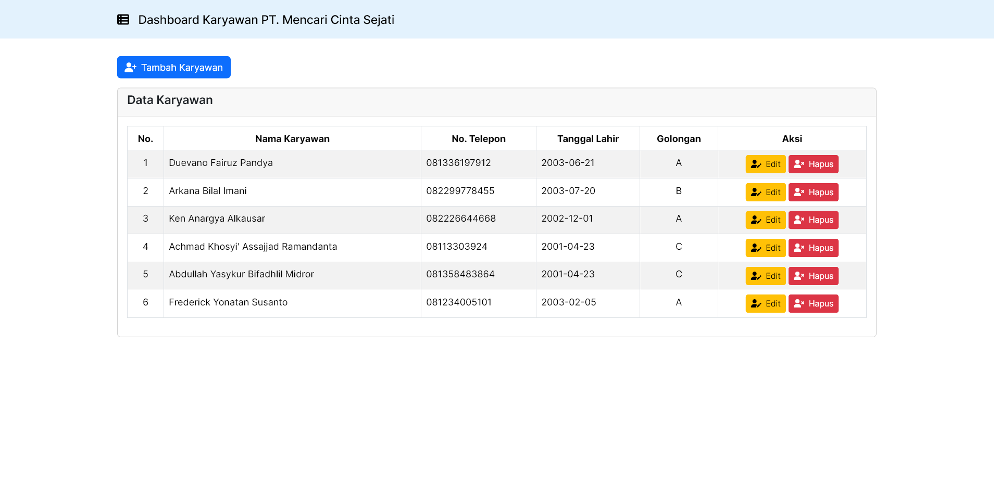
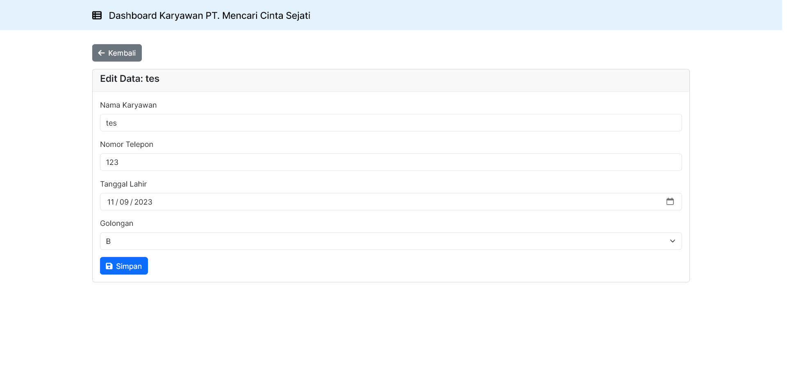
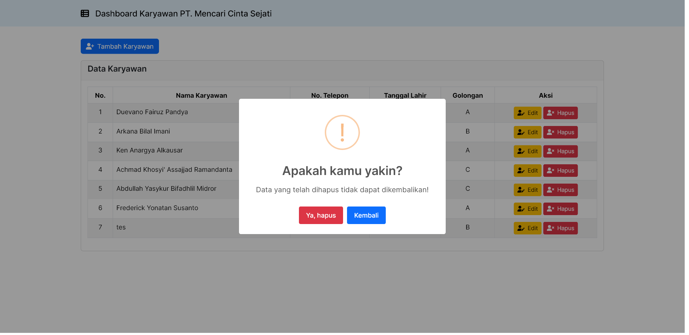

# PBKK-latihan9 (Code Igniter CRUD)

Arkana Bilal Imani / 5025211034

### Langkah - Langkah
1. `git clone`
2. `composer update`
3. Buka `localhost/phpmyadmin`
4. Buka menu SQL, masukkan command SQL dari file `ci4_crud.sql`
5. `php spark serve`

### Screenshots

